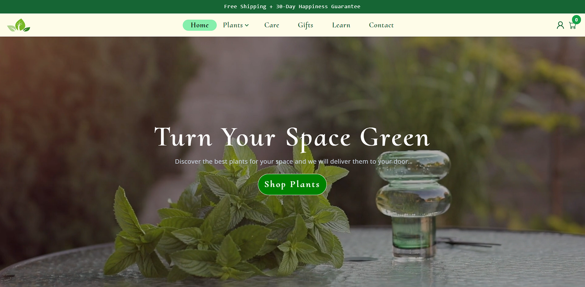

# Green Space E-Commerce Website

**Live Website**: [https://plant-shop-app.vercel.app/]



**Green Space** is an e-commerce website developed using React.js. It serves as the front-end for an online plant shop, enabling users to browse, search, and purchase various plants. This project showcases my front-end development skills and is an integral part of my portfolio.

## Table of Contents

- [Project Overview](#project-overview)
- [Features](#features)
- [Technologies Used](#technologies-used)
- [Installation](#installation)
- [Usage](#usage)
- [Screenshots](#screenshots)
- [Contributing](#contributing)
- [License](#license)
- [Contact](#contact)

## Project Overview

The Green Space e-commerce website aims to provide users with a seamless plant shopping experience. It boasts the following key features:

- **User Authentication**: Users can register, log in, and maintain personalized profiles.
- **Product Listings**: A wide range of plants with detailed information is available for browsing.
- **Shopping Cart**: Users can add and remove items from their cart and view the total price.
- **Product Details**: Detailed plant information, including multiple perspective photos, is accessible.
- **Search and Filters**: Plants can be easily found using the search bar and filter options.
- **Animations and Visuals**: The website is enhanced with GIFs, animations, sliders, videos, and more to engage users effectively.

## Features

- User registration and authentication.
- Dynamic product listings with product detail pages.
- Interactive shopping cart with the ability to remove items and clear the cart.
- Search functionality to find specific plants.
- Filter options for sorting plants by category, color, care level, and more.
- Responsive design for an exceptional user experience across all devices.
- Modern and visually appealing UI with animations and visuals.
- Intuitive navigation with a user-friendly interface.

## Technologies Used

- **React.js**: The core framework for building the front-end.
- **React Router**: Used for navigation within the application.
- **React Icons**: Provides a wide range of icons for the user interface.
- **Framer Motion**: Adds animations to create an engaging experience.
- **React Scroll**: For scrolling on the same page. 
- **React Modal**: Used for creating modals and dialogs.
- **Tailwind CSS**: The CSS framework for styling.
- **Vite**: The development and bundling tool.
- **ESLint**: Ensures code quality through linting.
- **GitHub**: Used for version control.
- **UUID**: Generates unique IDs for various elements.

## Installation

1. Clone the repository:

   ```bash
   git clone https://github.com/Ana-1995/ecommerceapp.git
